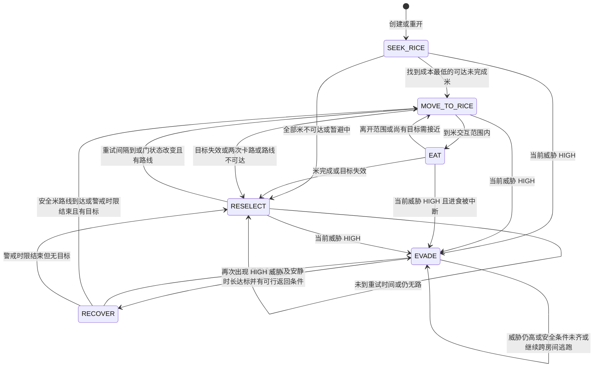
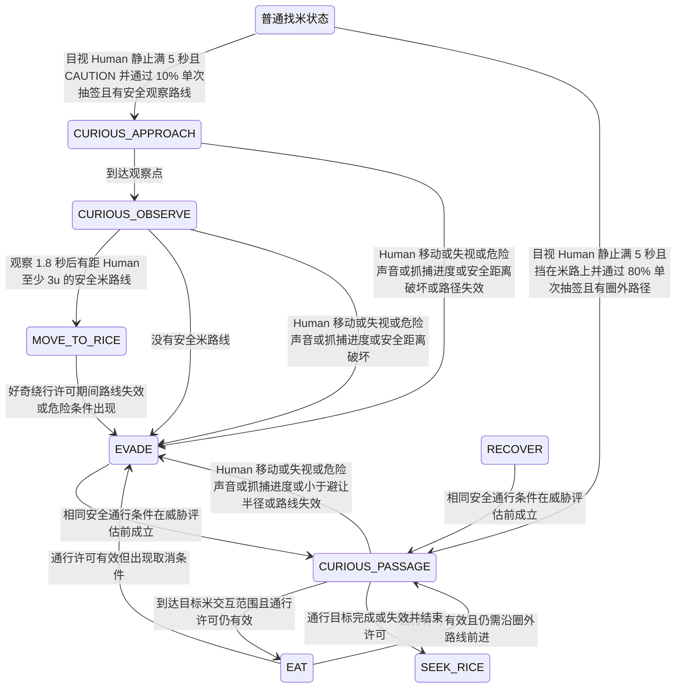
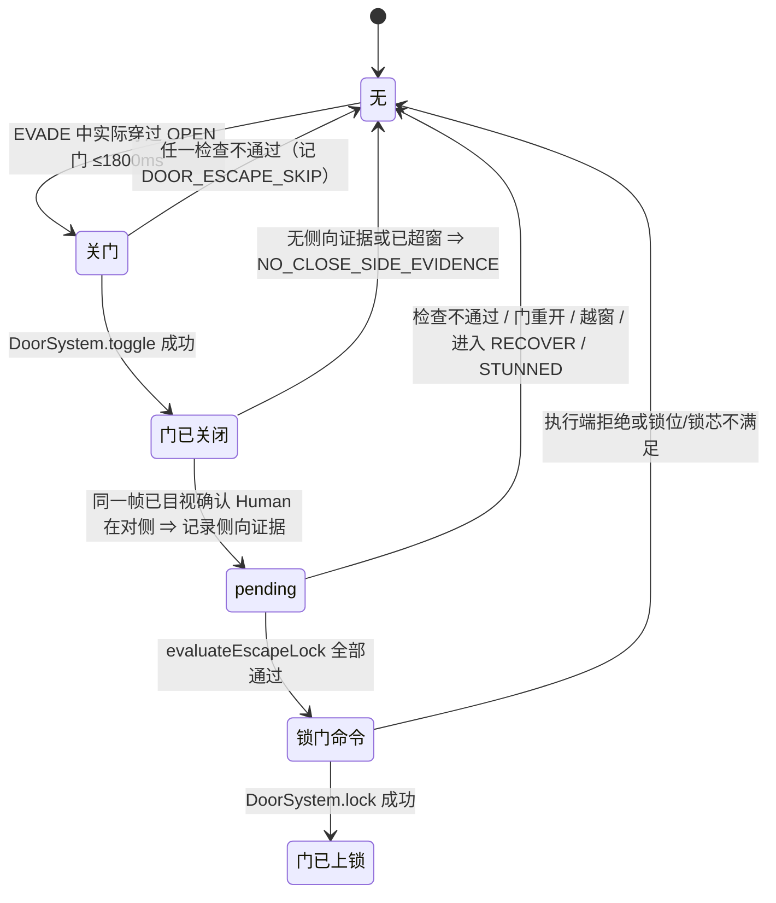

# DeepSeek AI 状态树（当前工作区源码）

依据：src/systems/DeepSeekAIController.ts、NavigationSystem.ts、PerceptionSystem.ts、RiceField.ts、RiceSystem.ts、SprintSystem.ts、DoorSystem.ts、GameStateSystem.ts、src/three/ThreeGame.ts 及 src/config/gameConfig.ts。SEEK_RICE～RECOVER 属 S7B-1/2；好奇与静止 Human 安全通行已完成专项人工验收；主动关门属 S7B-3A（人工验收 PASS），主动锁门属 S7B-3B（3B-1 锁门、3B-2 防振荡均已人工验收 PASS，3B-3 定向回归 333/333）。数值一律以 `src/config/gameConfig.ts` 与 `docs/GAME_BALANCE_CONFIG.md` 为准，本文件不再维护第二份数值表。

## 状态树与正交标记

DeepSeekAIState 是扁平联合类型，下面的父节点只作阅读分组，不是代码里的层级状态机：

- 找米：SEEK_RICE、MOVE_TO_RICE、EAT、RESELECT（已实现）
- 生存：EVADE、RECOVER（已实现）
- 好奇：CURIOUS_APPROACH、CURIOUS_OBSERVE（已实现，专项人工验收 PASS）
- 静止 Human 安全通行：CURIOUS_PASSAGE（已实现，专项人工验收 PASS）

passageActive 可在 AI 的 EAT 状态中仍为 true；curiosityBypassActive 可在 MOVE_TO_RICE 中仍为 true，故二者是**并行许可标志**，不能只看 state 名称判断威胁折扣。ThreatSource NONE / VISION / SOUND / LAST_SEEN / MEMORY 与 threatLevel NONE / CAUTION / HIGH 是感知评估/记忆，不是 AI 状态。SprintState NORMAL / SPRINT_RUNNING / STUNNED 是独立 SprintSystem 状态；RiceInteractionState PREPARING / EATING / INTERRUPTED / COMPLETED 属于 RiceSystem，不是 AI 状态。

## 基础找米与生存转换

图中 “HIGH” 为本帧评估到的高威胁；安全通行/好奇许可的临时降级与取消见下一图。

EAT 是“AI 发出 eatRiceId”的意图状态，不代表已过准备阶段。ThreeGame 在静止、Sprint NORMAL 且仍在范围时才把此意图交给唯一 RiceField.update；RiceSystem 负责每次 400 ms 准备、进度保留、完成与 5/5 胜利。EVADE 或移动导致进食中断但不清既有进度。

## 好奇、安全通行及失败分支

此图中的“普通状态”表示 SEEK_RICE / MOVE_TO_RICE / EAT / RESELECT；安全通行尝试在每帧普通威胁评估**之前**运行，故也可能在 EVADE/RECOVER 中抢占。图只标实际代码可走的边。

如果 80% 抽签失败，标记该静止事件已抽过，不在同一事件逐帧重抽；仍按正常威胁/找米流程。抽中但无安全路线时记录 NO_SAFE_ROUTE，也不穿过抓捕圈。通行分支一旦抽过，同时抑制同一事件的 10% 好奇抽签。若普通好奇抽签失败、无安全观察点或中断，分别按代码保留当前流程或进入 EVADE，并在结束/中断后进入 12 秒好奇冷却。普通好奇观察后启用 curiosityBypassActive，允许继续已检查的米路线；如果失视但没有危险声音，撤销后续视线折扣而不强制重置当前米路线。安全通行没有独立“永久 Human 安全”状态，Human 移动、失视或有效危险应取消许可。

## 每个状态的条件

| 状态 | 进入 | 保持/实际行为 | 退出 |
|---|---|---|---|
| SEEK_RICE | 初始、重开、通行目标失效后 | 下一次有效 update 按成本寻找未完成米 | 有目标 → MOVE_TO_RICE；无目标 → RESELECT；HIGH → EVADE；符合好奇/通行条件 → 对应状态 |
| MOVE_TO_RICE | 选米、RECOVER 结束、好奇观察后的安全绕行 | 共享 A* 路径；普通关门可打开，锁门不可走；按路径点移动 | 到米附近 → EAT；无路/卡路/米失效 → RESELECT；HIGH → EVADE；可能被试探抢占 |
| EAT | 在交互范围内 | 发出 eatRiceId 并静止；实际准备/进度在 RiceField | 米完成/失效 → RESELECT；离开 → MOVE_TO_RICE；HIGH/通行取消 → EVADE |
| RESELECT | 米失效、无路或连续卡路 | 1,500 ms 后重试；门状态变化可提前重试，暂避不可达米 | 有可达目标 → MOVE_TO_RICE；HIGH → EVADE |
| EVADE | HIGH 威胁，或好奇/通行中断 | 选可达房间、沿路移动；可按条件请求现有冲刺。STUNNED 时外部规则禁动；真正无路返回零方向并给原因 | 非 HIGH、足够安静/拉开距离、最短逃跑时间与路线条件满足 → RECOVER；安全通行可在威胁评估前抢占 |
| RECOVER | EVADE 满足脱险条件 | 1,200 ms 内**沿安全米路线移动**，不是必须站立；危险米/路径暂避 | 再次 HIGH → EVADE；到安全米或计时结束 → MOVE_TO_RICE / RESELECT；安全通行可能抢占 |
| CURIOUS_APPROACH | 目视远距 CAUTION 的静止 Human、单次 10% 通过且往返路径安全 | 走向至少 3 u 外的观察点 | 到点 → CURIOUS_OBSERVE；危险/路径失效 → EVADE |
| CURIOUS_OBSERVE | 到安全观察点 | 原地观察 1,800 ms；可触发表现层好奇动作插槽，但无正式素材 | 有安全米路线 → MOVE_TO_RICE + 临时绕行许可；否则/危险 → EVADE |
| CURIOUS_PASSAGE | 静止 Human 挡住预计米路线，单次 80% 抽中，存在 1.35 u 圈外动态路径 | 在当前 Human 可见位置外规划安全路径；必要时换别的米；普通门仍可开 | 到米 → EAT（许可仍在）；目标完成/失效 → SEEK_RICE；危险/失视/路径不安全 → EVADE |

优先级不是简单固定列表：外部控制门控/比赛阶段先决定是否调用 AI；本帧先推进既有计时/卡路/门签名，再检查可见 Human 的静止事件及 80% 通行，之后取消不安全许可、评估威胁；HIGH 抢占普通找米与好奇，接着处理有效通行、EVADE/RECOVER、好奇、最后普通找米。STUNNED 在生存动作中禁动，最终 SprintSystem.movementDirection 也执行禁动。暂停由 ThreeGame 停止 PLAYING 更新，冻结 AI 计时。开发临时接管与正式控制 DeepSeek 时 AI 不调用，交还后重建路径；重开 reset。

## 主动关门与主动锁门（S7B-3A / S7B-3B）

只在 **EVADE** 中评估。门动作都是**一次性交互**，不会打断冲刺（`SprintSystem.movementDirection` 在 `SPRINT_RUNNING` 时恒返回 `lastDirection`）。

- **关门（S7B-3A）**：门为 `OPEN`、DeepSeek 实际刚穿过它（≤ `doorEscapeCrossingWindowMs` 1800ms）、距离 ≤ `door.interactionRange`、同门冷却 `doorEscapeCooldownMs` 5000ms 已过、当前**目视** Human 在门另一侧且距离 ≥ `doorEscapeMinHumanDistance` 1.5、门未被角色占叶、关门后仍有**不经该门**的逃生路线、且 Human 到逃跑目标的当前路线确实经过该门。
- **侧向证据与关门后失视（关键修复）**：关门这一动作会让门叶挡住视线。因此在确认关门的那一帧记录 `doorLockEvidence = { doorId, deepseekSide }`；下一帧若**重新看见** Human，一律以最新目视信息为准（已同侧 / 距离 < 1.5 / 明显逼近 → 取消）；若**失视**（正因为该门已关闭），只复用同门、同一次连续动作的侧向证据，并重新核验门仍 `CLOSED`、DeepSeek 侧别未变、交互距离与不可隔墙、锁位余量、锁芯可用、逃生路线与米堆可达。该证据**不得**当作 Human 的实时位置，也不作为「距离仍然安全」的证明。
- **锁门（S7B-3B）**：`pending` 仅在「本次关门成功 + 仍在 1800ms 窗口 + 该门确有本次确认的侧向证据」时建立；每个连续动作**至多一次尝试**；成功、失败、取消一律清 pending 与侧向证据。**同时最多 3 把 Active Lock**（`GAME_CONFIG.door.maxActiveLocks`），**不限制整局总次数**；锁芯被扫雷/强破置 `DISABLED` 后本局该门不可再锁。
- **自关门防折返**：逃生规划会排除「本门冷却内由自己关上的门」（`recentlySelfClosedDoors`）；`followPath` 遇到这类门清路径并重规划（导航原因 `SELF_CLOSED_DOOR_REPATH`，AI 日志事件 `DOOR_ESCAPE_SELF_CLOSED` 带门 ID）。若排除后**没有任何**可达房间，则回退一次允许使用该门（导航原因 `*_SELF_CLOSED_FALLBACK`），避免原地卡死。
- **冲刺与门**：`SPRINT_RUNNING` **不再取消**门动作；门动作不触碰 `SprintSystem`，冲刺计时与 30% 必摔完整保留。冲刺技能另有 `GAME_CONFIG.sprint.cooldownMs` 30000ms 冷却，**一开始冲刺即进入冷却**，期间不能再次冲刺；DEV 以 READY / ACTIVE / COOLDOWN / STUNNED 与剩余时间显示，AI 日志以 `SPRINT_READINESS` 事件记录 CD 生命周期。

## 感知公平性与目标/路径

| 信息 | 实际来源 | 精度/用途 |
|---|---|---|
| visibleHuman | VisionSystem 当前无遮挡且范围内才由 ThreeGame 传 Human 当帧位置 | 仅此时可用精确 Human 坐标、距离和静止计时；距离 ≤ `visionEvadeDistance`（当前 5 u）为 HIGH，较远为 CAUTION |
| heardHuman | SoundEventSystem.heardBy 的可听 Human 声音，已计算范围、距离与墙/门遮挡 | 隐身时只把声源方向量化为八方向，再投射 4 u 的**粗略威胁点**；不把声音事件的精确坐标直接用作逃跑目标 |
| lastSeenHuman | VisionSystem 在上次真看见 Human 时保存的历史点/时间 | AI 仅在失视后 2,500 ms 内作为 CAUTION；不是实时位置 |
| rice / rooms / doors | 游戏系统给的五份激活米真实状态、地图房间与当前门状态 | 找米和路线所需的对象信息，不属于对 Human 的透视感知 |
| captureProgressMs / sprintState | GameStateSystem、SprintSystem 的现有玩法状态 | 有实际抓捕进度时取消试探；冲刺/眩晕按原规则生效 |

选米：对未完成、未临时避让的米，用共享 NavigationSystem 的可达路径计算 **路径长度 ÷ DeepSeek 基础速度 + 剩余进食毫秒 + 400 ms 准备**；最小者优先，同分按米 ID。房间级逃跑：对实际可达房间中心评分，综合可信威胁点距离、路线长度和沿路风险、墙/门遮挡、可用出口、死路/堵出口/替代路线、近 4 次房间访问惩罚（12 秒衰减）；近分候选（0.8 分带内）随机选。目标通常保持 2,500 ms，危险增大、路径失效、局部循环或抵达后仍有 HIGH 才重评估。循环检测为重访房间且安全距离没有增加至少 1 u；真正没有可达房间时返回零移动并标原因。动态安全通行使用同一个 NavigationSystem 的临时 avoidCircle，不另建寻路器；最终移动仍经过 CollisionWorld，普通关门可开、锁门不能穿。

## 数值索引

**唯一数值来源**：`src/config/gameConfig.ts`；完整索引见 `docs/GAME_BALANCE_CONFIG.md`。本文件**不再维护第二份数值表**——此前这里的副本已与源码漂移（`visionEvadeDistance`、`escapeGoalHoldMs`、`dangerRiceAvoidMs`、`curiositySafeDistance`、`stationaryPassageChance/SafetyMargin`、抓捕圈余量等均为旧值），故删除，避免继续误导排查。

与 AI 决策最易混淆的几项：

| 变量 | 当前值 | 说明 |
|---|---:|---|
| `GAME_CONFIG.deepseekAI.visionEvadeDistance` | 5 | 目视 Human 距离 ≤ 此值为 HIGH，超过为 CAUTION。 |
| `GAME_CONFIG.match.captureRadius` | 0.70 | 真实抓捕圈半径；**不等于**任何警戒距离。 |
| `GAME_CONFIG.deepseekAI.stationaryPassageSafetyMargin` | 0.20 | 抓捕圈外的动态绕行余量；当前动态半径 0.70 + 0.20 = 0.90 u。 |
| `GAME_CONFIG.deepseekAI.doorEscapeMinHumanDistance` | 1.5 | 关门 / 锁门时与目视 Human 的最低距离。 |
| `GAME_CONFIG.deepseekAI.doorEscapeCrossingWindowMs` | 1,800 | 实际过门后允许考虑关门 / 锁门的窗口。 |
| `GAME_CONFIG.deepseekAI.doorEscapeCooldownMs` | 5,000 | 同一扇门的关门冷却（按门独立）。 |
| `GAME_CONFIG.door.maxActiveLocks` | 3 | 同时有效的锁上限；不限制整局总次数。 |
| `GAME_CONFIG.sprint.cooldownMs` | 30,000 | 冲刺技能冷却；冲刺一开始即计时。 |

声音各事件 range / strength / lifetime 与墙 / 门遮挡倍率同样由 `GAME_CONFIG.perception` 配置，详见 `docs/GAME_BALANCE_CONFIG.md`。

## 静态风险（不是本轮测试结论）

- 安全通行尝试在 assessThreat 前运行，且未排除 EVADE/RECOVER；静止且可见、挡路时可能先从逃跑/恢复转到通行。实际优先级取决于当前输入与取消条件，不能简单声称“紧急逃跑永远先于好奇”。
- 通行期间 state 可变成 EAT，但 passageActive 仍为 true；仅按 state 制作 HUD 或排查可能误判许可仍在。类似地，普通好奇完成后 MOVE_TO_RICE 可伴随 curiosityBypassActive。
- 可见 Human 的小位移 ≤ 0.05 u 会继续累计“静止”；边界处抖动可能使一次静止事件与视线丢失重置交替。80% 抽签先于 10%，挡路时会抑制好奇观察抽签。
- EVADE 到达房间中心且 HIGH 时会暂时零方向等待重评估；真正无路、开门等待、STUNNED、RECOVER 无安全米路线、RESELECT 重试间隔也会零方向。它们需要与拐角卡路区分。
- 非 HIGH 的可听声音仍为 CAUTION；RECOVER 的安全米路线检查和 Last Seen/安静计时可能延迟恢复，安全条件在边界波动时可能再转 EVADE。
- 门状态签名变化、路径点停滞、目标米失效会清路径或重新选目标；房间评分的近分随机与目标保持、回访惩罚同时存在，仍可能出现局部循环。以上为代码静态风险而非已复现故障。
- resumeAfterManualControl 现会显式撤销 passageActive，再清路径并结束普通好奇；临时接管后归还控制的定向测试已覆盖该状态清理。浏览器手感仍待人工验收。
