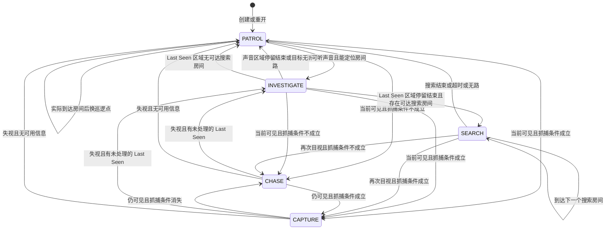

# Human AI 状态树（当前源码）

依据：src/systems/HumanAIController.ts、NavigationSystem.ts、PerceptionSystem.ts、DoorSystem.ts、HumanDoorSkill.ts、GameStateSystem.ts、src/three/ThreeGame.ts 和 src/config/gameConfig.ts。只描述源码；不把分析当成新验收。

## 状态与层级

HumanAIState 在代码中是**扁平状态联合类型**，没有运行时父状态。下面仅按用途分组：

- 默认/信息行动：PATROL（已实现）、INVESTIGATE（已实现）、SEARCH（已实现）
- 对抗：CHASE（已实现）、CAPTURE（已实现）
- CHECK_HIDE（**仅预留类型**，当前没有进入它的代码；正式藏身检查尚未实现）

门策略 NONE / DETOUR / UNLOCK / FORCE_BREAK 是并行的 HumanAILockDecision，不是 AI 状态。比赛阶段、门状态、抓捕进度也由其他系统维护。

## 转换图

失视后若没有新 Last Seen、但有新可听声音，可转 INVESTIGATE；图中 PATROL 是无信息兜底。下图没有 CHECK_HIDE 的边是有意的。

## 进入、持续、退出

| 状态 | 进入 | 持续行为 | 退出 |
|---|---|---|---|
| PATROL | 初始/重开、调查或搜索结束、追丢/不可达回退 | 从当前位置选择最近可达且未巡查的主要房间，实际到达才记 visited；走完可达房间后重开一轮 | 当前可见 → CHASE/CAPTURE；新声音 → INVESTIGATE |
| INVESTIGATE | 新声音事件；或 CHASE/CAPTURE 失视且 Last Seen 时间戳未处理过 | 声音只去声源所在**房间中心**；Last Seen 去记录的**最后目击位置**。到达后停留 3,000 ms。Last Seen 调查不被声音覆盖 | 可见 → CHASE/CAPTURE；声音调查结束 → PATROL；目击调查结束 → SEARCH，若无搜索房间则 PATROL；无路 → PATROL |
| SEARCH | Last Seen 区域停留结束 | 搜索邻接且 12 世界单位内的至多 3 个可达房间，各停留 900 ms，总计不超过 15,000 ms | 可见 → CHASE/CAPTURE；完成、超时、无路 → PATROL |
| CHASE | 当前可见但不满足抓捕资格 | 以本帧真实可见的 DeepSeek 位置为精确追逐目标 | 资格成立 → CAPTURE；失视 → Last Seen / 声音调查或 PATROL |
| CAPTURE | 当前可见且外部抓捕 eligible | AI 移动指令为零；外部 GameStateSystem 累计 350 ms 并判胜 | eligible 消失且仍可见 → CHASE；失视 → 调查或巡逻；FINISHED 后 AI 停止更新 |
| CHECK_HIDE | 无 | 仅预留 | 无 |

每帧决策优先级：**当前目视 > 追丢后新 Last Seen > 新可听事件 > 当前调查/搜索/巡逻**。声音不能抢占 Last Seen 调查或 SEARCH。正式选择 Human、开发模式临时接管 Human/IJKL、PAUSED/READY/FINISHED 时由 ThreeGame 的 shouldRunHumanAI 门控停止 AI；这不是额外状态。归还控制只清路径和进行中的 AI 解锁进度，重开才完整 reset。

## 信息来源与目标/路径

| 输入 | 观察还是系统数据 | 实际使用 |
|---|---|---|
| visibleTarget | VisionSystem 当前视线；墙、关门和锁门阻挡 | 精确追逐目标；可见时最高优先 |
| lastSeen | VisionSystem 在真实看见时记录的位置与时间，最长保留 8 秒 | 仅追丢时去历史点，不读墙后实时坐标 |
| heard | SoundEventSystem.heardBy 的可听事件，已按距离与墙门衰减 | 只用事件所在房间中心，不用隐藏角色精确位置 |
| captureEligible | 游戏系统的抓捕圈半径和遮挡判定 | CAPTURE 与 CHASE 切换；胜负由 GameStateSystem 负责 |
| rooms / doors / cooldown | 游戏系统给的静态地图及当前门/技能状态 | 巡逻、搜索、路线和开门选择；并非对手感知 |

Human AI 不读取 Rice Trace，也不使用 Human 静止计时。共用 NavigationSystem 的 XZ A* 网格（0.4 世界单位）、八向移动但禁止斜穿墙角；最终位移仍经 CollisionWorld。普通 CLOSED 门作为可走的高成本边，到交互侧调用 DoorSystem.toggle。锁门时比较绕行与穿锁规划路径时间：CD 就绪可强破，否则 AI 用自己的耗时/概率模拟解锁，**不操作玩家扫雷 UI**。AI 解锁成功调用 DoorSystem.disableLock，使 LOCKED → CLOSED，之后仍须开门；强破调用 HumanDoorSkill，直接 OPEN。门/锁芯/CD/失败避让变化、周期或卡路使路径重算。

## 实际配置、计时与概率

均在 src/config/gameConfig.ts；ms=毫秒，u=XZ 世界单位，倍率/概率无单位。

| 变量 | 当前值 | 用途 |
|---|---:|---|
| GAME_CONFIG.humanAI.movementSpeedMultiplier | 0.92 | 仅 AI Human 的移动倍率；底速为 player.speed 230 像素/秒 ÷ three.pixelsPerUnit 60 × human.speedMultiplier 1.08 |
| GAME_CONFIG.humanAI.navCellSize | 0.4 u | 寻路格 |
| GAME_CONFIG.humanAI.repathIntervalMs | 500 ms | 路径周期重算 |
| GAME_CONFIG.humanAI.waypointTolerance | 0.25 u | 到达节点 |
| GAME_CONFIG.humanAI.stuckRepathMs / stuckProgressEpsilon | 800 ms / 0.05 u | 卡路重算判据 |
| GAME_CONFIG.humanAI.investigationDwellMs | 3,000 ms | 调查停留 |
| GAME_CONFIG.humanAI.searchRadius / searchRoomCount | 12 u / 3 房 | Last Seen 周边搜索 |
| GAME_CONFIG.humanAI.searchDwellMs / searchMaxMs | 900 ms / 15,000 ms | 搜索点停留 / 总时限 |
| GAME_CONFIG.humanAI.closedDoorPathCost / lockedDoorPathCost | 3 / 12 | 门的无量纲路径成本 |
| GAME_CONFIG.humanAI.aiUnlockDurationMs / aiUnlockSuccessChance | 8,750 ms / 0.7 | AI 单次解锁耗时 / 成功概率 |
| GAME_CONFIG.humanAI.aiUnlockMaxAttempts / aiUnlockFailureAvoidMs | 2 次 / 6,000 ms | 单门尝试上限 / 失败后暂避 |
| GAME_CONFIG.humanAI.forceBreakReserveMs / detourSlackMs | 1,800 ms / 600 ms | 锁门方案比较 |
| GAME_CONFIG.door.interactionRange / humanForceBreakCooldownMs | 1.3 u / 30,000 ms | 实际门交互范围 / 强破 CD |
| GAME_CONFIG.match.captureRadius / captureMs | 0.70 u / 350 ms | 外部抓捕判定 |
| GAME_CONFIG.perception.visionRange / lastSeenMs / minimumAudibleStrength | 11 u / 8,000 ms / 0.015 | 感知门槛；具体声音 range、strength、lifetime 和遮挡倍率另见 gameConfig.ts |

Human AI 没有单独听声 CD 或 CHECK_HIDE 定时器。

## 静态风险（本轮未修改或复测）

- 遮挡边界反复开合时，CHASE/CAPTURE 可能与 INVESTIGATE 频繁切换。
- INVESTIGATE 目标无法到达会退 PATROL；下帧若再次看到目标又追逐。声音调查可被不同房间的新事件改写，但 Last Seen/SEARCH 不受声音打断。
- CAPTURE 主动停步、各调查停留和有限搜索停留是代码定义的静止；应与真实卡路区分。
- 全部可达巡逻房间完成后 visited 清空，可达房间很少时可能重复近处巡逻。门状态签名与 CD 切换也会促发重规划。
- setTarget 遇到目标变化超过 0.4 u 会清除正在进行的 AI 解锁进度；追逐目标频繁移动时有进度难积累风险。
