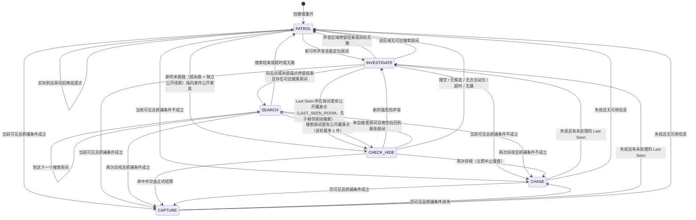

# Human AI 状态树（当前源码）

依据：src/systems/HumanAIController.ts、NavigationSystem.ts、PerceptionSystem.ts、DoorSystem.ts、HumanDoorSkill.ts、GameStateSystem.ts、src/three/ThreeGame.ts 和 src/config/gameConfig.ts。只描述源码；不把分析当成新验收。

## 状态与层级

HumanAIState 在代码中是**扁平状态联合类型**，没有运行时父状态。下面仅按用途分组：

- 默认/信息行动：PATROL（已实现）、INVESTIGATE（已实现）、SEARCH（已实现）
- 对抗：CHASE（已实现）、CAPTURE（已实现）
- CHECK_HIDE（**已实现，S7C-2**）：由公开线索（亲自看见的米痕、Last Seen、有效声音、有限搜索的房间）触发，前往某件公开家具的合法站位、面向其可搜查表面停留 900 ms 后执行一次正式搜查判定。

门策略 NONE / DETOUR / UNLOCK / FORCE_BREAK 是并行的 HumanAILockDecision，不是 AI 状态。比赛阶段、门状态、抓捕进度也由其他系统维护。

## 转换图

失视后若没有新 Last Seen、但有新强危险声音，可转 INVESTIGATE；新的米痕线索可转 INVESTIGATE 或 CHECK_HIDE；图中 PATROL 是无信息兜底。

```mermaid
stateDiagram-v2
    [*] --> PATROL: 创建或重开
    PATROL --> INVESTIGATE: 新可听声音且能定位房间
    PATROL --> CHECK_HIDE: 新的米痕链（或米痕 + 独立公开线索）指向某件公开家具
    PATROL --> CHASE: 当前可见且抓捕条件不成立
    PATROL --> CAPTURE: 当前可见且抓捕条件成立
    INVESTIGATE --> CHASE: 当前可见且抓捕条件不成立
    INVESTIGATE --> CAPTURE: 当前可见且抓捕条件成立
    INVESTIGATE --> PATROL: 声音区域停留结束或目标无路
    INVESTIGATE --> SEARCH: 目击点或米痕锚点停留结束且存在可达搜索房间
    INVESTIGATE --> CHECK_HIDE: Last Seen 所在房间里有公开藏身点（LAST_SEEN_ROOM，先于相邻房间搜索）
    INVESTIGATE --> PATROL: 该区域无可达搜索房间
    SEARCH --> CHASE: 再次目视且抓捕条件不成立
    SEARCH --> CAPTURE: 再次目视且抓捕条件成立
    SEARCH --> CHECK_HIDE: 搜索房间里有公开藏身点（该轮最多 1 件）
    SEARCH --> PATROL: 搜索结束或超时或无路
    CHECK_HIDE --> CHASE: 再次目视（立即中止搜查）
    CHECK_HIDE --> CAPTURE: 命中并交由正式结算
    CHECK_HIDE --> INVESTIGATE: 新的强危险声音
    CHECK_HIDE --> SEARCH: 来自搜索房间且搜空后回到剩余房间
    CHECK_HIDE --> PATROL: 搜空 / 无候选 / 无合法站位 / 超时 / 无路
    CHASE --> CAPTURE: 仍可见且抓捕条件成立
    CAPTURE --> CHASE: 仍可见且抓捕条件消失
    CHASE --> INVESTIGATE: 失视且有未处理的 Last Seen
    CAPTURE --> INVESTIGATE: 失视且有未处理的 Last Seen
    CHASE --> PATROL: 失视且无可用信息
    CAPTURE --> PATROL: 失视且无可用信息
    PATROL --> PATROL: 实际到达房间后换巡逻点
    SEARCH --> SEARCH: 到达下一个搜索房间
```

## 进入、持续、退出

| 状态 | 进入 | 持续行为 | 退出 |
|---|---|---|---|
| PATROL | 初始/重开、调查或搜索结束、追丢/不可达回退 | 从当前位置选择最近可达且未巡查的主要房间，实际到达才记 visited；走完可达房间后重开一轮 | 当前可见 → CHASE/CAPTURE；新声音 → INVESTIGATE；新米痕线索 → INVESTIGATE/CHECK_HIDE |
| INVESTIGATE | 新声音事件；或 CHASE/CAPTURE 失视且 Last Seen 时间戳未处理过；或新发现的米痕（来源 `TRACE`，去最新线索处） | 声音只去声源所在**房间中心**；Last Seen 去记录的**最后目击位置**；米痕去**推断锚点**（最新连续痕迹末端）。到达后停留 3,000 ms。Last Seen 调查不被声音覆盖，也**不被更早的米痕批次抢占** | 可见 → CHASE/CAPTURE；声音调查结束 → PATROL；Last Seen 停留结束 → **先考虑最后目击房间的公开藏身家具（`LAST_SEEN_ROOM`）**，门槛不成立才 → SEARCH；米痕锚点停留结束 → SEARCH，若无搜索房间则 PATROL；无路 → PATROL |
| SEARCH | Last Seen 区域或米痕锚点停留结束 | 搜索邻接且 12 世界单位内的至多 3 个可达房间，各停留 900 ms，总计不超过 15,000 ms；搜索房间里若有公开藏身点，该轮可转 CHECK_HIDE 一次 | 可见 → CHASE/CAPTURE；完成、超时、无路 → PATROL；转 CHECK_HIDE |
| CHECK_HIDE | 公开米痕链（或单一米痕 + 独立公开线索）指向某件公开家具；或 SEARCH 到达含公开藏身点的房间；或 `LAST_SEEN_ROOM`（最后目击房间里有公开藏身点） | 导航到该家具的合法搜查站位（真实角色圆 + 真实导航格 + A* 可达 + 1.5 内 + 前方 120° + 无墙门遮挡）；**导航网格点只作寻路节点，到达后继续最终接近规划保存的原始 `stancePoint`**，只有站位谓词成立才进入 `DWELL`，朝 `faceHeadingRad` **不移动**停留 900 ms，然后**请求一次**正式判定；正式判定使用**规划保存的表面点**，执行前复核它仍属于当前地图的目标家具，且公开几何全部通过后才读一次权威占用 | 搜中 → 外部正式结算（`forceCapture`）；搜空 → 记录该家具 6 秒失败冷却、收起本次动作（**保留调查级预算**），`SEARCH` / `LAST_SEEN_ROOM` 来源回到有限搜索、其余回到 PATROL；`STANCE_LOST / HEADING_LOST / PLAN_STALE / OUT_OF_RANGE / OUTSIDE_FAN / BLOCKED` → 取消（不记搜空、不进冷却、不写公开失败记忆；计划失效可**有界**退还配额）；可见目标 → CHASE/CAPTURE；新强危险声 → INVESTIGATE；超时/无路/无候选 → PATROL |
| CHASE | 当前可见但不满足抓捕资格 | 以本帧真实可见的 DeepSeek 位置为精确追逐目标 | 资格成立 → CAPTURE；失视 → Last Seen / 声音调查或 PATROL |
| CAPTURE | 当前可见且外部抓捕 eligible，或 CHECK_HIDE 命中 | AI 移动指令为零；外部 GameStateSystem 累计 350 ms 并判胜 | eligible 消失且仍可见 → CHASE；失视 → 调查或巡逻；FINISHED 后 AI 停止更新 |

每帧决策优先级（S7C-2）：**当前目视 > 追丢后新 Last Seen > 新强危险声音 > 公开米痕线索 > 普通声音与旧调查任务 > 家具搜查与既有有限搜索 > 巡逻**。普通声音与米痕**不会**打断正在执行的 CHECK_HIDE（只先记进线索记忆，本次搜查结束后再评估）；强危险声音与真实目视可以立即中止搜查。声音不能抢占 Last Seen 调查或 SEARCH。

修复轮补充两条：① 米痕优先级处理的是「**存在已知但尚未用于发起任务的公开线索**」，而不是「本帧是否发现新米痕」——被目视 / 危险声 / 正式搜查压住的批次会带着**原实体的有效期**排队，等 AI 能决策时重评（全部过期则记 `CLUE_EXPIRED`，绝不续期）；同一个 Last Seen 调查进行中时该批次继续等待，不抢占。② 每轮家具配额拆成「已开始的尝试」与「已正式执行」两个计数：开始过但被抢占同样占用本轮配额（避免中断后反复重跑 A*）。

第二轮修复轮补充三条：① **导航终点 ≠ 正式站位**——A* 吸附的导航网格点只作寻路节点，到达后 AI 必须在真实 `CollisionWorld` 下继续**最终接近**规划保存的原始 `stancePoint`，并且只有用**与权威判定逐字相同的谓词**（`evaluateHideStance`，容差仍为 `humanAI.waypointTolerance + collision.contactEpsilon`）判定成立才允许进入 `DWELL`；卡住时按既有 `stuckRepathMs` 有界收尾且不退还本轮配额。② **类型化解析**：`HEADING_LOST` 与既有的 `STANCE_LOST / PLAN_STALE / OUT_OF_RANGE / OUTSIDE_FAN / BLOCKED` 全部是「未完成合法检查」，不记搜空、不进 6 秒冷却、不写公开失败记忆；只有 `MISS_EMPTY` / `HIT_CONCEALED` 才算真正完成的正式检查，计数改在游戏层回执时消耗。③ **权威占用查询顺序**：公开几何（计划仍属当前地图 → 站位 → 朝向 → 1.5 u / 120° / 墙门遮挡）全部通过后才惰性读取一次权威占用，几何失败时读取次数为零。

Human **玩家** Q（与 Human AI 无关，但共用同一套公开家具解析；规则见 S7C 设计文档 §4.7）：按 Q 时**先**看有没有**未藏身**的 DeepSeek 娘落在原有合法抓捕范围（1.5 世界单位、120° 扇形、墙门遮挡）→ 有就抓人，即使自己正站在某件家具的交互区域内并正对着它；**否则**再看有没有「玩家站在其合法交互区域内 **且** 朝向对着它」的家具 → 有就只搜查这一件家具（该分支不做 1.5 u / 120° 判定）；两者都没有才普通扇形空挥。白色呼吸描边与「Q 搜查」提示只在这件家具**同时**满足「合法 + 被指向 + 当帧没有暴露目标」时出现，否则压暗或不显示。四种有效释放都消耗同一份 12 秒冷却，冷却中一律直接拒绝。**第四轮修复轮只改描边的画法**（判定逻辑未动）：改为沿家具 12 条棱的真实轮廓 + 0.35–1.0 呼吸透明度；此前看不见是因为表现层根节点被扇形释放搬走、把高亮的世界坐标二次平移（见 S7C 设计文档 §4.8）。

正式选择 Human、开发模式临时接管 Human/IJKL、PAUSED/READY/FINISHED 时由 ThreeGame 的 shouldRunHumanAI 门控停止 AI；这不是额外状态。归还控制只清路径和进行中的 AI 解锁进度并中止半途搜查，重开才完整 reset。

Human 玩家 Q 的白色家具轮廓及 DP 娘的家具 / 米堆轮廓是玩家交互提示，不属于 AI 状态，也不改变 `CHECK_HIDE` 的决策或权威搜查几何。S7C-2 集中人工验收已由用户确认通过；当前规则与 DP 娘提示边界见 [S7C 设计文档 §4.9](S7C_HIDE_RANDOMIZATION_DESIGN.md#49-s7c-2-最终规则与集中人工验收2026-09-27)。

## 信息来源与目标/路径

| 输入 | 观察还是系统数据 | 实际使用 |
|---|---|---|
| visibleTarget | VisionSystem 当前视线；墙、关门和锁门阻挡 | 精确追逐目标；可见时最高优先 |
| lastSeen | VisionSystem 在真实看见时记录的位置与时间，最长保留 8 秒 | 仅追丢时去历史点，不读墙后实时坐标 |
| heard | SoundEventSystem.heardBy 的可听事件，已按距离与墙门衰减 | 只用事件所在房间中心，不用隐藏角色精确位置 |
| captureEligible | 游戏系统的抓捕圈半径和遮挡判定 | CAPTURE 与 CHASE 切换；胜负由 GameStateSystem 负责 |
| heardDanger | 同一 `heardBy` + 既有 `isHumanPursuitSound`（FOOTSTEP / SPRINT / FALL / FORCE_BREAK）分类 | 第 3 优先级；可抢占搜查；不新造声音类型，也不把普通门操作声当危险 |
| visibleTraces | **图层 B**：`RiceTraceClues.selectVisibleTraces()` 用正式视觉几何（距离 + 墙体 + 非 OPEN 门叶）过滤后的米痕 | 只有这些会写进有限线索记忆（图层 C）；AI 内部还会用自己的真实几何再确认一次 |
| nowMs | 与米痕系统同一个正式玩法时钟 | 线索有效期判定；不读浏览器时间 |
| rooms / doors / cooldown | 游戏系统给的静态地图及当前门/技能状态 | 巡逻、搜索、路线和开门选择；并非对手感知 |
| 公开地图快照（藏身点 + 家具 + 站位/遮挡接缝） | 当前已应用地图的公开数据与真实几何接口 | CHECK_HIDE 的候选、站位与遮挡判定；**不含占用状态或隐藏坐标** |

Human AI 现在会读取米痕，但**只读取它自己真正看得见的那部分**，并且只保存有限快照（图层 C）用于循迹；它不读取 `HideSystem.occupancyOf()`、真实藏身点 ID、隐藏时的实时坐标或任何开发者真值。共用 NavigationSystem 的 XZ A* 网格（0.4 世界单位）、八向移动但禁止斜穿墙角；最终位移仍经 CollisionWorld。普通 CLOSED 门作为可走的高成本边，到交互侧调用 DoorSystem.toggle。锁门时比较绕行与穿锁规划路径时间：CD 就绪可强破，否则 AI 用自己的耗时/概率模拟解锁，**不操作玩家扫雷 UI**。AI 解锁成功调用 DoorSystem.disableLock，使 LOCKED → CLOSED，之后仍须开门；强破调用 HumanDoorSkill，直接 OPEN。门/锁芯/CD/失败避让变化、周期或卡路使路径重算。

## 实际配置、计时与概率

均在 src/config/gameConfig.ts；ms=毫秒，u=XZ 世界单位，倍率/概率无单位。

| 变量 | 当前值 | 用途 |
|---|---:|---|
| GAME_CONFIG.humanAI.movementSpeedMultiplier | 0.92 | 仅 AI Human 的移动倍率；底速为 player.speed 230 像素/秒 ÷ three.pixelsPerUnit 60 × human.speedMultiplier 1.08 |
| GAME_CONFIG.humanAI.navCellSize | 0.4 u | 寻路格 |
| GAME_CONFIG.humanAI.repathIntervalMs | 500 ms | 路径周期重算 |
| GAME_CONFIG.humanAI.waypointTolerance | 0.25 u | 到达节点 |
| GAME_CONFIG.humanAI.stuckRepathMs / stuckProgressEpsilon | 800 ms / 0.05 u | 卡路重算判据 |
| GAME_CONFIG.humanAI.investigationDwellMs | 3,000 ms | 调查停留 |
| GAME_CONFIG.humanAI.searchRadius / searchRoomCount | 12 u / 3 房 | Last Seen 周边搜索；S7C-2 也复用 3 作为「同一次调查最多检查的家具数」 |
| GAME_CONFIG.humanAI.searchDwellMs / searchMaxMs | 900 ms / 15,000 ms | 搜索点停留 / 总时限；S7C-2 的正式搜查停留与搜查总预算复用这两个值 |
| GAME_CONFIG.humanAI.hideCheckFailureCooldownMs | 6,000 ms | S7C-2：同一件家具搜空后再次检查的冷却 |
| GAME_CONFIG.humanAI.hideCheckMaxPerRound | 1 件 | S7C-2：每轮最多正式检查的家具数 |
| GAME_CONFIG.humanSearch.range / halfAngleDeg | 1.5 u / 60° | S7C-2：正式搜查复用玩家 Q 的扇形（整体张角 120°） |
| GAME_CONFIG.perception.traceStepDistance / traceLifetimeMs | 0.65 u / 15,000 ms | 米痕生成间距与寿命；S7C-2 的连接距离 = 0.65 × 6 = 3.9 u |
| GAME_CONFIG.humanAI.closedDoorPathCost / lockedDoorPathCost | 3 / 12 | 门的无量纲路径成本 |
| GAME_CONFIG.humanAI.aiUnlockDurationMs / aiUnlockSuccessChance | 8,750 ms / 0.7 | AI 单次解锁耗时 / 成功概率 |
| GAME_CONFIG.humanAI.aiUnlockMaxAttempts / aiUnlockFailureAvoidMs | 2 次 / 6,000 ms | 单门尝试上限 / 失败后暂避 |
| GAME_CONFIG.humanAI.forceBreakReserveMs / detourSlackMs | 1,800 ms / 600 ms | 锁门方案比较 |
| GAME_CONFIG.door.interactionRange / humanForceBreakCooldownMs | 1.3 u / 30,000 ms | 实际门交互范围 / 强破 CD |
| GAME_CONFIG.match.captureRadius / captureMs | 0.70 u / 350 ms | 外部抓捕判定 |
| GAME_CONFIG.perception.visionRange / lastSeenMs / minimumAudibleStrength | 11 u / 8,000 ms / 0.015 | 感知门槛；具体声音 range、strength、lifetime 和遮挡倍率另见 gameConfig.ts |

Human AI 没有单独听声 CD。`CHECK_HIDE` 的停留与失败冷却都走正式的 `deltaMs`（由 ThreeGame 传入），控制器内部既没有 `setInterval` 也没有读浏览器时间。S7C-2 的全部内部技术阈值集中在 `src/systems/HumanSearchTuning.ts`（**不**放进 `GAME_CONFIG`，因为它们不是玩法平衡值）。

## 静态风险（本轮未修改或复测）

- 遮挡边界反复开合时，CHASE/CAPTURE 可能与 INVESTIGATE 频繁切换。
- INVESTIGATE 目标无法到达会退 PATROL；下帧若再次看到目标又追逐。声音调查可被不同房间的新事件改写，但 Last Seen/SEARCH 不受声音打断。
- CAPTURE 主动停步、各调查停留和有限搜索停留是代码定义的静止；应与真实卡路区分。
- 全部可达巡逻房间完成后 visited 清空，可达房间很少时可能重复近处巡逻。门状态签名与 CD 切换也会促发重规划。
- setTarget 遇到目标变化超过 0.4 u 会清除正在进行的 AI 解锁进度；追逐目标频繁移动时有进度难积累风险。
- S7C-2：米痕线索每 0.65 世界单位就可能换一个新签名，因此「同一件家具 6 秒失败冷却 + 每轮 1 件 + 同一次调查最多 3 件 + 共享 15 秒搜查预算」是三重上限；改动其中任何一个都会改变 AI 的搜查强度。
- S7C-2：线索链连接距离（3.9 u）明显大于米痕生成间距，因此玩家停下再跑时链仍会被接上；把该值调小会让 AI 更常只看到「单粒米」而退回调查。
- S7C-2：站位合法性依赖 `standable` / `lineBlocked` / `pathNodes` 三个真实接缝；缺省时是**失败即拒绝**（站不住、被挡住、不可达），所以忘接线只会让 AI 不搜查，不会让它作弊。这三个接缝与公开地图快照由 `src/systems/HumanHideSearchResolution.ts` 的 `createHumanAiMapSnapshot()` **单点构造**，`HumanAIController` 必须整份保留（`this.map = { ...map }`）；只挑 `furniture` / `hideSpots` 会让接缝落回缺省值、AI 静默不搜查。
- S7C-2 修复轮：`LAST_SEEN_ROOM` 与相邻房间搜索**共用同一轮家具配额**，所以同一次调查里最多只会因为「最后目击房间」多搜 1 件家具；这是遵守「每轮最多 1 件」的结果，不是遗漏。
- S7C-2 修复轮：正式判定的 `OUT_OF_RANGE` / `OUTSIDE_FAN` 在正常执行路径里几乎不可达（站位间距固定 0.3 u、规划已校验几何），它们保留为分层防御；真正会因为地图变化触发的是 `PLAN_STALE`（取消并重规划，不记搜空、不进冷却）。
