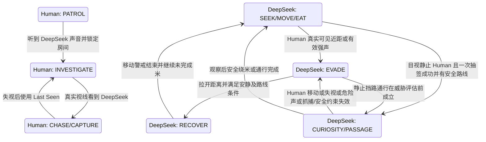

# 双方 AI 状态总览与交互风险（当前源码）

详细条件见 [Human 状态树](AI_HUMAN_STATE_TREE.md) 与 [DeepSeek 状态树](AI_DEEPSEEK_STATE_TREE.md)。本文件源自一次静态源码审计；后续好奇与安全通行专项已有用户验收，当前状态以 `docs/DEEPSEEK_HANDOFF.md` 和 `docs/AGENT_LOG.md` 为准。本文件不是当前测试报告。

## 已实现与预留

| 角色 | AI 状态（源码中的扁平联合类型） | 状态以外的并行系统/标记 |
|---|---|---|
| Human | PATROL、INVESTIGATE、SEARCH、CHASE、CAPTURE 已实现；CHECK_HIDE **仅类型预留，没有入口** | HumanAILockDecision：NONE/DETOUR/UNLOCK/FORCE_BREAK；抓捕进度和胜负在 GameStateSystem |
| DeepSeek | SEEK_RICE、MOVE_TO_RICE、EAT、RESELECT、EVADE、RECOVER、CURIOUS_APPROACH、CURIOUS_OBSERVE、CURIOUS_PASSAGE 均已实现；静止 Human 好奇/安全通行专项已通过用户验收 | passageActive、curiosityBypassActive 为许可标记；ThreatSource/Level、SprintState、RiceInteractionState 为独立状态 |

两个控制器都没有代码层面的父/子层级；文档中的“找米/逃跑/对抗”等是用途分组。当前源码没有正式 CHECK_HIDE 藏身检查、DeepSeek 主动锁门 AI、团队策略或复杂行为树；不应画成已完成状态。

## 跨系统优先级

| 层级 | Human | DeepSeek |
|---|---|---|
| 0：执行门控 | 仅 PLAYING 且正式玩家选 DeepSeek，未临时接管 Human | 仅 PLAYING 且正式玩家选 Human，未临时接管 DeepSeek |
| 1：最即时信息 | 当前真实目视目标决定 CHASE/CAPTURE | 先检查静止 Human 安全通行许可；真实移动、失视、追捕型危险声、抓捕进度、安全距离失守或眩晕可取消许可 |
| 2：危险/记忆 | 失视后的新 Last Seen 调查，随后新可听声音 | Vision、有效 Sound、短期 Last Seen 形成 HIGH/CAUTION/NONE；HIGH 抢占普通吃米和好奇，进入 EVADE |
| 3：当前任务 | SEARCH / INVESTIGATE / PATROL；门锁策略随路径执行 | 有效通行优先执行；否则 EVADE/RECOVER、好奇观察、常规找米依次处理 |
| 4：动作执行 | 门开关、AI 解锁/强破和最终 Circle Collision | 普通开门、SprintSystem、唯一 RiceField.update、最终 Circle Collision |

“优先级”指源码 update/ThreeGame 调用顺序，不代表所有行为是硬抢占：Human SEARCH 和 Last Seen 调查不会被声音事件改写；DeepSeek 通行可在 HIGH 评估前从 EVADE/RECOVER 激活，成功后把当前静止 Human 的视觉威胁暂降为 CAUTION，但移动、失视、有效危险声、抓捕进度或圈外距离失守会取消。

## 关键交互关系

这张图表示两套控制器在同一比赛中的**因果关系**，不是共享状态机。Human 声音目标是声源所在房间中心；DeepSeek 听到墙后的 Human 仅使用八方向投射的粗略威胁点。两者都复用 S6 Vision/Sound/Last Seen；各自获取地图和本局米目标属于游戏系统供给，并非“看穿对手”。当前 Last Seen 最长保留 8 秒，但 DeepSeek AI 只在失视后的 2.5 秒内以它维持 CAUTION。

米由 RiceField 唯一计时：当前开发模式每份正式进食 5 秒，未来正式配置为 60 秒；每次开始/续吃准备 0.4 秒；五份全部完成才获胜。Human 抓捕由 GameStateSystem 的 0.70 世界单位有效圈和连续 0.35 秒计时决定。AI 状态、角色动作表现都不替代这些规则。DeepSeek 冲刺/摔倒由 SprintSystem 处理：持续 2.5 秒，米总进度达到 30% 后结束必眩晕 1 秒。Human 的 AI 自动解锁单次 8.75 秒、成功概率 0.7，和玩家 4×4 扫雷 UI 是不同入口；强破使用现有 30 秒 CD。

## 当前最值得关注的状态冲突风险

| 风险 | 源码原因 | 可能观察到的现象；不是本轮复测结论 |
|---|---|---|
| DeepSeek 安全通行与威胁优先级 | `tryStartPassage` 在普通威胁评估前检查；许可仍受实际危险取消条件约束 | 该顺序支持静止 Human 附近的安全通行；回归须确认紧急危险仍会取消 |
| 单状态名不足以解释许可 | passageActive 可伴随 EAT；curiosityBypassActive 可伴随 MOVE_TO_RICE | 仅看 HUD state 可能误判为何普通可见 Human 没触发逃跑；应连同许可、威胁等级查看 |
| Human 视线边缘反复切换 | 目视优先于 Last Seen 与声音；丢失视线即调查 | 门开关、墙边或角色微移动时 CHASE/CAPTURE ↔ INVESTIGATE，路径和解锁进度也可能重置 |
| DeepSeek 逃跑/恢复来回 | HIGH 会进入 EVADE；RECOVER 仍在每帧威胁评估之后运行 | 声音阈值或视线反复越界可使 EVADE ↔ RECOVER 或 EAT → EVADE 频繁发生 |
| 多种合法零移动分支 | CAPTURE 停步、调查/搜索停留；DeepSeek 无路线、房间中心短暂保持、RESELECT 等待、STUNNED、RECOVER 无安全米路线 | “原地站住”并非都属于同一个寻路故障，应结合 noMovementReason、recoveryBlockReason、门与路径状态查 |
| 房间目标与路径相互覆盖 | 门签名改变清路径；卡路重算；逃跑房间评分、保持时间、近分随机和短期访问惩罚并存 | 房间或门口反复换路、临时不动；当前 S7B-2 已接受的偶发原地停留仍列后续优化 |
| 静止 Human 事件边界 | `HumanStillness` 独立记录静止事件；DeepSeek 仅在有效视野中读取，不因遮挡清零。普通好奇概率为 10%，安全通行判断概率为 100%，同一静止事件各自只判断一次 | 100% 只保证执行安全路线判断，不保证存在安全路线；参数以源码及数值表为准 |
| 临时接管后的许可清理 | `resumeAfterManualControl` 显式结束 passageActive 并清路径；定向测试和专项验收已完成 | 后续若改接管流程，回归检查许可清理和重新寻路 |

以上为静态源码审计中值得持续回归的交互点，不等同于当前已复现缺陷。好奇与安全通行专项的后续实现及验收状态，以最新交接文档和历史日志为准；此处不记录本轮测试结果。
