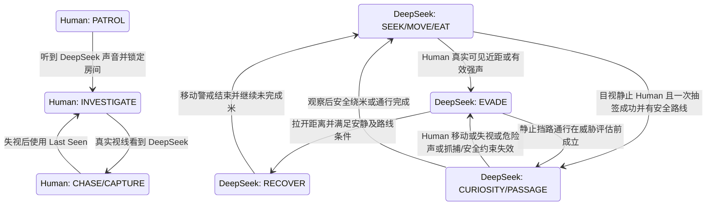

# 双方 AI 状态总览与交互风险（当前源码）

详细条件见 [Human 状态树](AI_HUMAN_STATE_TREE.md) 与 [DeepSeek 状态树](AI_DEEPSEEK_STATE_TREE.md)。本文件源自一次静态源码审计；后续好奇与安全通行专项已有用户验收，当前状态以 `docs/DEEPSEEK_HANDOFF.md` 和 `docs/AGENT_LOG.md` 为准。本文件不是当前测试报告。

## 已实现与预留

| 角色 | AI 状态（源码中的扁平联合类型） | 状态以外的并行系统/标记 |
|---|---|---|
| Human | PATROL、INVESTIGATE、SEARCH、CHASE、CAPTURE、CHECK_HIDE 均已实现（CHECK_HIDE 自 S7C-2 起是真实运行状态） | HumanAILockDecision：NONE/DETOUR/UNLOCK/FORCE_BREAK；抓捕进度和胜负在 GameStateSystem；米痕线索记忆与家具候选在控制器内部 |
| DeepSeek | SEEK_RICE、MOVE_TO_RICE、EAT、RESELECT、EVADE、RECOVER、CURIOUS_APPROACH、CURIOUS_OBSERVE、CURIOUS_PASSAGE 均已实现；静止 Human 好奇/安全通行专项已通过用户验收 | passageActive、curiosityBypassActive 为许可标记；ThreatSource/Level、SprintState、RiceInteractionState 为独立状态 |

两个控制器都没有代码层面的父/子层级；文档中的“找米/逃跑/对抗”等是用途分组。**Human AI 的 CHECK_HIDE 藏身搜查已在 S7C-2 实现**（只用公开线索）；DeepSeek AI 仍没有自主锁门行为、团队策略或复杂行为树，也不做自主藏身（S7C-2b 未授权）；不应画成已完成状态。

## 玩家交互目标的视觉反馈（不属于 AI 状态）

S7C-2 集中人工验收已通过：Human Q 的白色家具轮廓、DP 娘的家具与米堆轮廓、交互重叠仲裁和生命周期均通过。人工 DP 只显示当前真实 E 仲裁允许的唯一目标；家具视觉指向 ±60°，米堆 ±45°，停步保持最后一次有效世界朝向。轮廓仅用于提示，不改变 E 藏身或进食规则；米堆目标须与 RiceField 实际处理的最近未完成米堆一致。具体实现与常量见 `docs/S7C_HIDE_RANDOMIZATION_DESIGN.md` §4.9。

## 跨系统优先级

| 层级 | Human | DeepSeek |
|---|---|---|
| 0：执行门控 | 仅 PLAYING 且正式玩家选 DeepSeek，未临时接管 Human | 仅 PLAYING 且正式玩家选 Human，未临时接管 DeepSeek |
| 1：最即时信息 | 当前真实目视目标决定 CHASE/CAPTURE，并立即中止搜查 | 先检查静止 Human 安全通行许可；真实移动、失视、追捕型危险声、抓捕进度、安全距离失守或眩晕可取消许可 |
| 2：危险/记忆 | 失视后的新 Last Seen，随后**新强危险声音**（既有 `isHumanPursuitSound` 分类，可抢占搜查） | Vision、有效 Sound、短期 Last Seen 形成 HIGH/CAUTION/NONE；HIGH 抢占普通吃米和好奇，进入 EVADE |
| 3：当前任务 | **已知但尚未处理的公开米痕线索**（含被目视 / 危险声 / 正式搜查延后、仍有效的批次）→ INVESTIGATE/CHECK_HIDE；否则 SEARCH / INVESTIGATE / PATROL；门锁策略随路径执行 | 有效通行优先执行；否则 EVADE/RECOVER、好奇观察、常规找米依次处理 |
| 4：动作执行 | 门开关、AI 解锁/强破、搜查站位与朝向、最终 Circle Collision | 普通开门、SprintSystem、唯一 RiceField.update、最终 Circle Collision |

“优先级”指源码 update/ThreeGame 调用顺序，不代表所有行为是硬抢占：Human SEARCH 和 Last Seen 调查不会被声音事件改写，Last Seen 调查也不会被**更早**的米痕批次抢占；正在执行的 CHECK_HIDE 也不会被**普通**声音或新米痕打断（新米痕只先写进线索记忆并在本次搜查结束后重评），但真实目视与新的强危险声音可以立即中止它。DeepSeek 通行可在 HIGH 评估前从 EVADE/RECOVER 激活，成功后把当前静止 Human 的视觉威胁暂降为 CAUTION，但移动、失视、有效危险声、抓捕进度或圈外距离失守会取消。

Human AI 的 CHECK_HIDE 在第二轮修复轮后有两处必须记住的语义：**到站判定以规划保存的原始 `stancePoint` 为准**（A* 导航网格点只作寻路节点，到达后继续最终接近，只有与权威判定同款的站位谓词成立才进入 `DWELL`）；**`STANCE_LOST / HEADING_LOST / PLAN_STALE / OUT_OF_RANGE / OUTSIDE_FAN / BLOCKED` 都是「未完成合法检查」**（不记搜空、不进 6 秒冷却、不计入正式检查数量），并且**公开几何全部通过后才会读取一次权威占用**。Human **玩家** Q 另有一套互斥用途（**第三轮修复轮起：暴露目标优先**，见 S7C 设计文档 §4.7）：当帧只要有**未藏身**的对手落在 1.5 u / 120° / 无墙门遮挡的原有抓捕范围内就**先抓人**，不因为玩家正站在家具交互区域内、正对着家具而改为搜查；没有暴露目标时才看「合法 + 被玩家指向」的家具并只搜查这一件（该分支不做 1.5 u / 120° 判定）；两者都没有才普通扇形空挥。白色呼吸描边与「Q 搜查」提示在暴露目标优先时压暗且不再提示可搜。**第四轮修复轮只改这套高亮的可见性**（判定逻辑未动）：描边改为**真实家具棱线轮廓**（`EdgesGeometry` 12 条棱，与家具同中心 / 同朝向 / 三轴外扩 0.08），呼吸透明度 0.35–1.0、周期仍 1,400 ms，冷却中压到 0.14；此前「DEV 说有高亮、屏幕上看不见」的根因是表现层根节点被普通扇形释放搬到玩家位置，把高亮的世界坐标二次平移了（详见 S7C 设计文档 §4.8）。

## 关键交互关系

```mermaid
stateDiagram-v2
    state "Human: PATROL" as HP
    state "Human: INVESTIGATE" as HI
    state "Human: CHASE/CAPTURE" as HC
    state "DeepSeek: SEEK/MOVE/EAT" as DR
    state "DeepSeek: EVADE" as DE
    state "DeepSeek: RECOVER" as DC
    state "DeepSeek: CURIOSITY/PASSAGE" as DQ
    HP --> HI: 听到 DeepSeek 声音并锁定房间
    HI --> HC: 真实视线看到 DeepSeek
    HC --> HI: 失视后使用 Last Seen
    DR --> DE: Human 真实可见近距或有效强声
    DE --> DC: 拉开距离并满足安静及路线条件
    DC --> DR: 移动警戒结束并继续未完成米
    DR --> DQ: 目视静止 Human 且一次抽签成功并有安全路线
    DE --> DQ: 静止挡路通行在威胁评估前成立
    DQ --> DE: Human 移动或失视或危险声或抓捕/安全约束失效
    DQ --> DR: 观察后安全绕米或通行完成
```

这张图表示两套控制器在同一比赛中的**因果关系**，不是共享状态机。Human 声音目标是声源所在房间中心；**Human 的米痕目标是它自己看见过的痕迹的推断锚点**（图层 C，不是全图实时米痕）；DeepSeek 听到墙后的 Human 仅使用八方向投射的粗略威胁点。两者都复用 S6 Vision/Sound/Last Seen；各自获取地图和本局米目标属于游戏系统供给，并非“看穿对手”。当前 Last Seen 最长保留 8 秒，但 DeepSeek AI 只在失视后的 2.5 秒内以它维持 CAUTION。

米由 RiceField 唯一计时：当前开发模式每份正式进食 5 秒，未来正式配置为 60 秒；每次开始/续吃准备 0.4 秒；五份全部完成才获胜。Human 抓捕由 GameStateSystem 的 0.70 世界单位有效圈和连续 0.35 秒计时决定。AI 状态、角色动作表现都不替代这些规则。DeepSeek 冲刺/摔倒由 SprintSystem 处理：持续 2.5 秒，米总进度达到 30% 后结束必眩晕 1 秒。Human 的 AI 自动解锁单次 8.75 秒、成功概率 0.7，和玩家 4×4 扫雷 UI 是不同入口；强破使用现有 30 秒 CD。

## 当前最值得关注的状态冲突风险

| 风险 | 源码原因 | 可能观察到的现象；不是本轮复测结论 |
|---|---|---|
| DeepSeek 安全通行与威胁优先级 | `tryStartPassage` 在普通威胁评估前检查；许可仍受实际危险取消条件约束 | 该顺序支持静止 Human 附近的安全通行；回归须确认紧急危险仍会取消 |
| 单状态名不足以解释许可 | passageActive 可伴随 EAT；curiosityBypassActive 可伴随 MOVE_TO_RICE | 仅看 HUD state 可能误判为何普通可见 Human 没触发逃跑；应连同许可、威胁等级查看 |
| Human 视线边缘反复切换 | 目视优先于 Last Seen 与声音；丢失视线即调查 | 门开关、墙边或角色微移动时 CHASE/CAPTURE ↔ INVESTIGATE，路径和解锁进度也可能重置 |
| DeepSeek 逃跑/恢复来回 | HIGH 会进入 EVADE；RECOVER 仍在每帧威胁评估之后运行 | 声音阈值或视线反复越界可使 EVADE ↔ RECOVER 或 EAT → EVADE 频繁发生 |
| 多种合法零移动分支 | CAPTURE 停步、调查/搜索停留；DeepSeek 无路线、房间中心短暂保持、RESELECT 等待、STUNNED、RECOVER 无安全米路线 | “原地站住”并非都属于同一个寻路故障，应结合 noMovementReason、recoveryBlockReason、门与路径状态查 |
| 房间目标与路径相互覆盖 | 门签名改变清路径；卡路重算；逃跑房间评分、保持时间、近分随机和短期访问惩罚并存 | 房间或门口反复换路、临时不动；当前 S7B-2 已接受的偶发原地停留仍列后续优化 |
| 静止 Human 事件边界 | `HumanStillness` 独立记录静止事件；DeepSeek 仅在有效视野中读取，不因遮挡清零。普通好奇概率为 10%，安全通行判断概率为 100%，同一静止事件各自只判断一次 | 100% 只保证执行安全路线判断，不保证存在安全路线；参数以源码及数值表为准 |
| 临时接管后的许可清理 | `resumeAfterManualControl` 显式结束 passageActive 并清路径；定向测试和专项验收已完成 | 后续若改接管流程，回归检查许可清理和重新寻路 |
| Human 的米痕循迹依赖「亲自看见」 | 只把正式视觉几何判定为可见的米痕写进有限线索记忆；线索按原实体过期（进待处理队列也不续期） | 米痕全部过期或始终不可见时 AI 不会产生家具怀疑，会退回既有 SEARCH/PATROL；这不是缺陷 |
| Human 的最后目击房间优先于相邻房间 | Last Seen 仍有效、坐标落在真实房间内、该房间确有公开藏身点时才考虑同房间家具，且与相邻房间搜索共用同一轮家具配额 | 门槛不成立就按原规则搜索相邻房间；同一次调查里不会因为两条分支多搜家具 |
| Human 搜查强度由多个上限叠加 | 每轮最多 1 件家具、同家具 6 秒失败冷却、同一次调查最多 `searchRoomCount`(3) 件、搜查动作共享 `searchMaxMs`(15,000 ms) | 调大任何一项都会让藏身玩法明显变难；改动前须重新验收 |
| 家具不参与视觉与搜查遮挡 | 候选与站位都只用公开数据；家具只参与 CollisionWorld 站位判定 | 「隔着家具」不会被判为遮挡，与既有全局规则一致；不要在此基础上单独给 AI 加一条家具体积遮挡 |

以上为静态源码审计中值得持续回归的交互点，不等同于当前已复现缺陷。好奇与安全通行专项的后续实现及验收状态，以最新交接文档和历史日志为准；此处不记录本轮测试结果。
